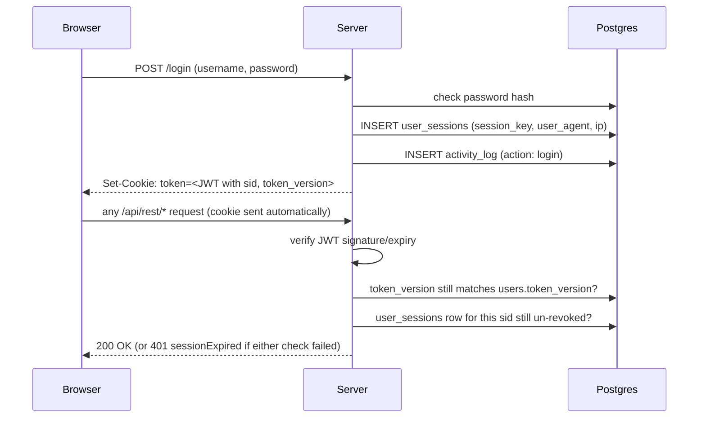

# Authentication & session security

How login, sessions, revocation, and the audit trail actually work under the
hood. If you're debugging an auth issue, reviewing this area for security, or
just want to understand what "log out this device" really does, start here.

For how to *report* a vulnerability in any of this, see [SECURITY.md](../SECURITY.md)
instead - this document is architecture, not a reporting policy.

## Contents

- [Mental model](#mental-model)
- [Logging in](#logging-in)
- [The JWT and its claims](#the-jwt-and-its-claims)
- [Validating a request](#validating-a-request)
- [`token_version`: revoke everywhere](#token_version-revoke-everywhere)
- [`user_sessions`: revoke one device](#user_sessions-revoke-one-device)
- [What the client does when a session dies](#what-the-client-does-when-a-session-dies)
- [Roles and the admin panel](#roles-and-the-admin-panel)
- [`activity_log`: the audit trail](#activity_log-the-audit-trail)
- [Two-factor authentication](#two-factor-authentication)
- [Passwords](#passwords)
- [Registration approval](#registration-approval)
- [Other defenses](#other-defenses)
- [Known limitations](#known-limitations)
- [Where this lives in code](#where-this-lives-in-code)

## Mental model

A session is a JWT in an httpOnly cookie, same as most apps. What's less usual
is that it's checked at **three independent layers** on every request, and
any one of them failing kills the session:

1. **Signature & claims** - is this JWT actually signed by this server, for
   this app, not expired? (stateless, pure crypto)
2. **`token_version`** - has the account's password changed since this token
   was issued? (one counter per *user*, invalidates every token at once)
3. **`user_sessions`** - has *this specific* login been individually logged
   out? (one row per *login*, invalidates just that one)

Layers 2 and 3 exist because a bare JWT can't be revoked once issued - it's
valid until it expires, full stop. Checking a DB counter and a DB row on every
request is what turns "stateless until expiry" into "revocable right now."

## Logging in

`POST /login` ([`AuthRoute.ts`](server/src/routes/AuthRoute.ts)):

1. Look up the account by code or email, compare the password with bcrypt.
   Wrong username *or* wrong password both get the same generic
   `"Invalid username or password."` (CWE-203 - don't let a client
   distinguish "no such user" from "wrong password").
2. **If two-factor auth is off**, create a session and log in immediately
   (step 4 below).
3. **If two-factor auth is on** (`users.totp_enabled`), stop here and issue a
   short-lived `pending_2fa_token` cookie instead (5 minutes, a distinct JWT
   `audience` so it can never be mistaken for a real session token even if it
   ended up in the wrong cookie). The client then calls `POST /login/2fa`
   with a 6-digit TOTP code (or a backup code); only *that* succeeding
   reaches step 4.
4. **Create the session**: a new `user_sessions` row (device's `User-Agent`,
   IP, timestamps - see [below](#user_sessions-revoke-one-device)), an
   `activity_log` row (`action: login`), and a signed JWT containing that
   session's key. Set it as the `token` cookie: `httpOnly`, `sameSite: strict`,
   `secure` in production, `maxAge` = `SESSION_TIME`.

A failed attempt at step 1 (or a failed TOTP/backup code at the 2FA step)
writes `activity_log` with `action: login_failed` - attributed to the account
if the username matched one (wrong password), or with no `actor_id` at all
if it didn't (metadata carries the attempted username instead, since there's
no account to attribute it to).

## The JWT and its claims

Signed with `HS256` using `JWT_SECRET`, audience `"vaultisse"`, issuer
`"vaultisse.com"` (the pending-2FA token uses a different audience so it's
rejected outright by anything expecting a real session).

| Claim | Meaning |
|---|---|
| `user_id` | The account this session belongs to. |
| `token_version` | A snapshot of `users.token_version` *at the moment this token was issued*. Compared against the live column on every request - see [below](#token_version-revoke-everywhere). |
| `sid` | The `user_sessions.session_key` this token was issued for - an opaque random UUID, unrelated to the JWT itself. Looked up on every request to check this *specific* login hasn't been individually revoked. |
| `exp` | Standard JWT expiry, `SESSION_TIME` milliseconds from issuance (`.env`, default 1 hour). |

The token is otherwise stateless - nothing about who's currently online lives
in memory. Everything derives from re-reading the DB on each request.

## Validating a request

Every protected route runs `requireAuth` (or `requireAuthPage` - see
[below](#what-the-client-does-when-a-session-dies)), both backed by the same
internal `resolveSession()` in
[`AuthMiddleware.ts`](server/src/middlewares/AuthMiddleware.ts):

1. No `token` cookie at all → treated as "never logged in."
2. `jwt.verify()` the cookie - bad signature, wrong audience/issuer, or
   expired → rejected outright, no DB call needed.
3. Look up the user by `decoded.user_id`; must exist and not be `disabled`.
4. Compare `decoded.token_version` to the live `users.token_version` - a
   mismatch means the password changed (or something else bumped it) since
   this token was issued. Rejected even though the signature is perfectly
   valid.
5. Look up `user_sessions` by `session_key = decoded.sid AND user_id = ...`.
   Missing, or `revoked_date` set → rejected. This is the check that makes
   "log out this device" actually work instead of just hiding a row in the UI.
6. On success: `last_seen_date` is bumped (throttled - only written if it's
   more than a minute stale, so this doesn't add a write to *every* request),
   and if the token has under 5 minutes left, a fresh one is silently issued
   with the same `sid`, extending the session without the user noticing.

`ALLOW_DEV_AUTH=true` (local development only - **never** in production, see
[SECURITY.md](../SECURITY.md)) skips all of this and fakes a session for user
id 1, using a sentinel `sid` (`"dev"`) that can never match a real
`user_sessions` row, so step 5 is skipped for it rather than always failing.

## `token_version`: revoke everywhere

`users.token_version` is a plain integer counter, incremented by exactly one
thing today: **changing your password** (`POST /user/password`). Every token
issued before that increment now fails check 4 above, on every device, the
next time each one makes a request - there's no way to keep using a stolen
or just-stale token once the password it was issued under no longer applies.

The response to a password change also reissues a fresh token for the
*current* device (same `sid`, new `token_version`) so that one device isn't
logged out by its own action - and, belt-and-suspenders, explicitly marks
every *other* `user_sessions` row as revoked at the same time, so "Active
sessions" in Settings reflects the change immediately instead of waiting for
each device's next request to notice its `token_version` no longer matches.

## `user_sessions`: revoke one device

One row per login (not per user - a user with three devices logged in has
three rows). Schema:

| Column | Purpose |
|---|---|
| `session_key` | The opaque value carried as the JWT's `sid`. |
| `user_agent`, `ip_address` | Captured at login, shown in Settings > Active sessions (device/browser parsed client-side, see `client/src/utils/DeviceInfo.ts`). |
| `created_date` | When this login happened. |
| `last_seen_date` | Last time this session made a request that passed validation (throttled updates, see above). |
| `revoked_date` | `NULL` while active; set once, never cleared, on explicit logout, "log out this device," or a password change revoking every *other* session. |

Timestamps are `TIMESTAMPTZ`, not the bare `TIMESTAMP` used elsewhere in this
schema - deliberately, since these are the first tables whose dates get
*compared* server-side rather than just displayed, and node-postgres
misreads a bare `TIMESTAMP` as being in the Node process's local timezone
rather than the DB session's, silently shifting it whenever the two differ.

**"Active"**, for `GET /user/sessions` (Settings > Active sessions), means
`revoked_date IS NULL AND last_seen_date` within the last `SESSION_TIME` -
so a session that simply timed out without an explicit logout drops off the
list on its own, without needing a cleanup job.

**Ending a session** happens three ways, all just setting `revoked_date`:
- `GET /logout` - the current device logging itself out. Best-effort: it
  tries to decode the cookie and revoke the matching row, but always clears
  the cookie and redirects to `/login` even if that lookup fails (already
  expired, cookie missing, whatever - logout should never itself get "stuck").
- `DELETE /user/sessions/:id` - "log out this device" in Settings, scoped to
  `WHERE user_id = <caller>` so you can only ever revoke your own sessions.
  Revoking your *current* one also clears your own cookie in the same response.
- A password change revoking every session but the current one (see above).

## What the client does when a session dies

A session can die between one request and the next - revoked from another
device, or just expired - with no way to push a notification to the browser
that's about to find out. The failure has to surface on that browser's
*next* request instead, and doing that cleanly needs to tell two very
different kinds of 401 apart:

- **The session itself is invalid** (this document, any of it) - should
  bounce the whole app to `/login`.
- **A 401 from ordinary in-page logic** - e.g. "Invalid current password"
  on the change-password form - should *not* nuke the page; the form just
  shows the error.

`requireAuth`'s failure response is `401 {"message": "Unauthorized",
"sessionExpired": true}` specifically for the first case; nothing else in
the API sets that flag. The client's shared axios interceptor
(`client/src/plugins/axiosInstance.ts`) checks for it and does a full
`window.location.href = "/login"` - a real navigation, not a router push,
since there's no SPA state worth preserving once the session is gone.

For the server-rendered `/app` and `/app/*` routes (a hard refresh, not an
API call), `requireAuthPage` redirects to `/login` directly on *any* failure
instead of returning JSON - there's no page on screen yet to show an error in.

## Roles and the admin panel

`users.role` is `'admin'` or `'user'` (a `CHECK`, not a Postgres ENUM - see
`assets/db/databaseSchema.sql`). There are deliberately **no library-level
roles**: this fork is one shared library, so every account that can log in
can add, edit, lend and return books. Application role is the only axis.

**Bootstrapping.** The first account to register becomes `admin`
(`POST /register`). The decision is made in SQL under a Postgres advisory
lock (`utils/AdvisoryLocks.ts`), not by a count-then-insert in Node: two
simultaneous first registrations each read a snapshot in which the other's
row doesn't exist yet, so both would otherwise come out admin. An
already-populated database being upgraded promotes its lowest-id account
instead (`assets/db/upgrade/1.2.0/2.sql`), for the same reason - an instance
with zero admins has no in-app way to make one.

**The gate.** `requireAdmin` (`middlewares/AdminMiddleware.ts`) wraps the
same `resolveSession()` as `requireAuth` - it does not re-derive a session
from the cookie - and then asks one further question: is this account's
`role` (read live from the DB on every request, never from a JWT claim, so a
demotion takes effect immediately) `'admin'`?

It fails in two distinguishable ways, which matters for the client:

| Case | Response |
|---|---|
| No session, or a session that no longer validates | `401 {"message": "Unauthorized", "sessionExpired": true}` - the client redirects to `/login`, exactly as for `requireAuth`. |
| A valid session belonging to a non-admin | `403 {"message": "Forbidden"}`, **no** `sessionExpired` flag - their session was never the problem, and logging back in would not help. |

**What an admin can do** (`/api/rest/admin/users`, AdminUsersRoute.ts): list
accounts, enable/disable one, promote/demote it, delete it. Three invariants
are enforced server-side, not by the UI hiding buttons:

1. An admin cannot demote, disable or delete **themselves**.
2. The instance can never reach **zero usable admins** (`role = 'admin'` and
   not disabled). Serialized by the `ADMIN_SET` advisory lock, so two admins
   demoting each other simultaneously can't both succeed.
3. Disabling or deleting an account **kills its live sessions immediately**:
   `users.token_version` is bumped and every `user_sessions` row revoked, so
   a held JWT stops working on its very next request - and, just as
   importantly, does not start working again if the account is later
   re-enabled.

Deleting an account does **not** delete what it contributed to the shared
library: those foreign keys are `created_by ... ON DELETE SET NULL`, so the
books stay and lose only their "added by" attribution.

The client learns its own role from `GET /app/policy`
(`user.role` / `user.isAdmin`) purely to decide whether to show the Admin nav
entry. That is a UI hint; the server re-checks on every request.

## `activity_log`: the audit trail

A generic, append-only table - not auth-specific by design, so future
data-change logging (book/loan edits, say) can reuse it instead of growing a
new table per feature. Only auth events are written today, via
[`ActivityAction`](server/src/utils/ActivityLog.ts):

| Column | Purpose |
|---|---|
| `actor_id` | Who did it. `NULL` for a failed login whose username didn't match any account (see [Logging in](#logging-in)) - `ON DELETE SET NULL`, so history outlives a deleted account. |
| `action` | Auth events (`login`, `login_failed`, `logout`, `password_changed`) and admin actions on an account (`user_enabled`, `user_disabled`, `user_role_changed`, `user_deleted`). |
| `entity_type`, `entity_id` | Unused for auth events. Admin actions set them to `'user'` + the target account id - the use those two generic columns were reserved for. There is no FK on `entity_id`, so a `user_deleted` row outlives the account it names (the account's code is kept in `metadata` so the entry stays readable). |
| `metadata` | Free-form JSONB - an IP address, an attempted username, which stage of login failed, and so on. |

`GET /user/activity` (Settings > Recent logins) returns *only* the calling
user's own rows, newest first, filtered to auth actions specifically
(`action = ANY(AUTH_ACTIVITY_ACTIONS)` - reads a named subset of the enum
rather than a separately maintained SQL list, so the two can't drift; admin
actions are excluded, since that list answers "what happened to my session",
not "what did I do to other people's accounts"). A failed login
against your account (wrong password from *somewhere else*) shows up here
too - deliberately: "someone tried your password and failed" is exactly the
kind of thing this list exists to surface.

## Two-factor authentication

TOTP (RFC 6238) via `otplib`, standard enough that any authenticator app
(Google Authenticator, Authy, 1Password, ...) works - despite the naming,
nothing here talks to Google. `users.totp_secret` is written on
`POST /user/2fa/setup` before it's confirmed; `users.totp_enabled` only
flips true once `POST /user/2fa/enable` verifies a code against it, at
which point a fresh set of one-time backup codes is generated (hashed with
the same bcrypt helper as passwords, shown to the user exactly once).
Disabling requires the account password, not a TOTP code, as re-auth - it's
removing a security layer rather than adding one, so it should be harder to
do by accident, not easier.

## Passwords

Hashed with bcrypt, 12 salt rounds. Never logged or stored in plaintext.
Registration and password-change both enforce: 8+ characters, an uppercase
letter, a digit, and a special character.

## Registration approval

By default, `POST /register` creates an account that can log in immediately.
Setting `REGISTRATION_REQUIRES_APPROVAL=true` (`.env`, default `false`)
switches new accounts to `users.disabled = TRUE` instead - the row exists,
but every login lookup filters on `disabled = FALSE` (see
[Validating a request](#validating-a-request) and `POST /login` in
AuthRoute.ts), so the account simply can't authenticate until someone flips
that column back to `FALSE`.

Approving one is `PATCH /api/rest/admin/users/:id` with
`{"disabled": false}` from the admin panel (see
[Roles and the admin panel](#roles-and-the-admin-panel)). This fork replaces
the hand-written `UPDATE users SET disabled = FALSE` that DEPLOYMENT.md used
to document as the only way.

**The first account to register is exempt**, and is created enabled even with
`REGISTRATION_REQUIRES_APPROVAL=true`. Approval means "an admin has to enable
you", and at that moment there is no admin - holding the first account would
produce an instance nobody can ever log into, with no in-app way out.

Disabling an account from the admin panel is the same column in the other
direction, plus immediate session revocation - see
[the section below](#roles-and-the-admin-panel).

## Other defenses

- **Rate limiting**: a global limiter (500 req / 10 min / IP) plus stricter,
  purpose-specific ones on the sensitive endpoints - login/register (5 / 5
  min), the 2FA code check (5 / 5 min, separate from login's so a legitimate
  user isn't left with too few attempts to type their code), and the
  current-password check on password change / 2FA disable (5 / 5 min, so a
  stolen session token can't be used to brute-force the actual password).
- **`TRUST_PROXY`**: `X-Forwarded-*` headers (used to key rate limits off
  the real client IP) are only trusted when this is explicitly set - a
  reverse proxy/tunnel sitting in front is what makes those headers
  meaningful; without one, trusting them would let anyone spoof their IP
  and bypass every limiter above.
- **Helmet** sets secure headers, including a Content-Security-Policy
  scoped to `'self'` plus the configured frontend origin and the two
  allowlisted book-cover image hosts.
- **CORS** is locked to `FRONT_END_URL` with credentials enabled - not `*`.
- **Cookies**: `httpOnly` (unreadable from JS, so an XSS can't just read the
  token), `sameSite: strict` (not sent cross-site, mitigating CSRF), `secure`
  in production (HTTPS only).
- **`DEMO_MODE=true`** rejects every non-safe request except the login flow,
  so a public read-only demo can't be used to modify shared data.

## Known limitations

- **No push notification on remote revocation.** Ending a session elsewhere
  doesn't notify that browser proactively - it just fails validation on its
  *next* request. Until then, that tab still looks logged in.
- **`ALLOW_DEV_AUTH=true` bypasses everything above.** It exists purely to
  skip login during local development and must never be reachable in a real
  deployment - see [SECURITY.md](../SECURITY.md)'s scope notes.
- **One `JWT_SECRET` for the whole deployment**, not per-session - rotating
  it invalidates every session at once (nothing partial), which is usually
  what you'd want anyway if it's ever suspected of leaking.
- **No anomaly detection.** A login from a new country, an impossible-travel
  pattern, etc. aren't flagged - "Recent logins" and "Active sessions" in
  Settings are there so a user can *notice* something themselves, not
  something the server watches for on its own.

## Where this lives in code

| Concern | File |
|---|---|
| Login, register, logout, 2FA login step | `server/src/routes/AuthRoute.ts` |
| Per-request validation (`requireAuth`/`requireAuthPage`) | `server/src/middlewares/AuthMiddleware.ts` |
| Admin gate (`requireAdmin`) | `server/src/middlewares/AdminMiddleware.ts` |
| Admin account management (list/enable/disable/promote/delete) | `server/src/routes/admin/AdminUsersRoute.ts` |
| Advisory-lock keys (first-account bootstrap, admin-set invariant) | `server/src/utils/AdvisoryLocks.ts` |
| JWT signing/verification, bcrypt helpers | `server/src/AppService.ts` |
| Session list / revoke / recent-activity endpoints, password change, 2FA setup/enable/disable | `server/src/routes/UserRoute.ts` |
| Writing `user_sessions` rows | `server/src/utils/UserSessions.ts` |
| Writing `activity_log` rows | `server/src/utils/ActivityLog.ts` |
| TOTP/backup-code helpers | `server/src/utils/TwoFactorAuth.ts` |
| Demo-mode write blocking | `server/src/middlewares/DemoModeMiddleware.ts` |
| `users`/`user_sessions`/`activity_log`/`user_backup_codes` schema | `assets/db/databaseSchema.sql` |
| Client: redirect-on-`sessionExpired`, cookie transport | `client/src/plugins/axiosInstance.ts` |
| Client: Active sessions / Recent logins UI | `client/src/views/settings/SessionsCard.vue`, `LoginActivityCard.vue` |
