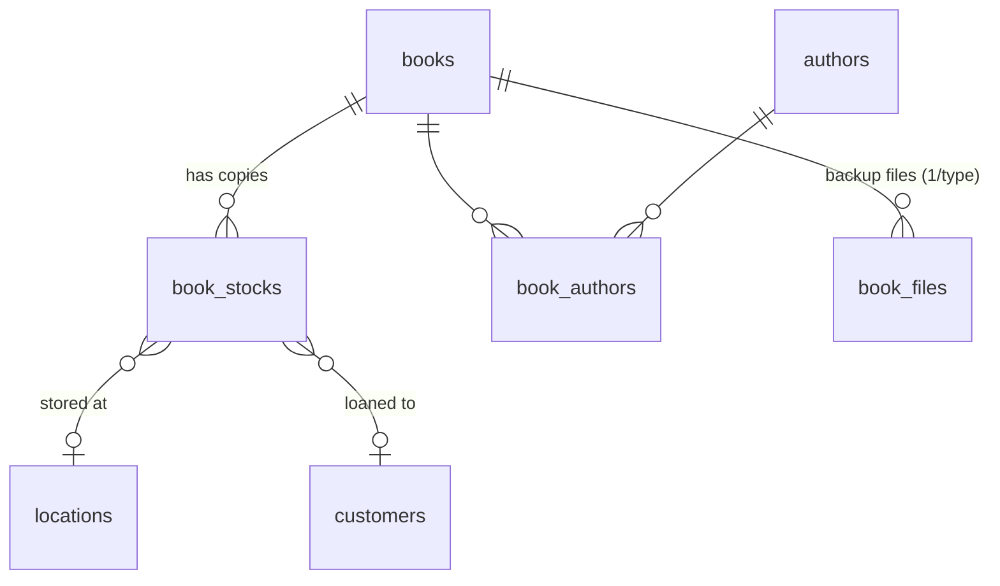
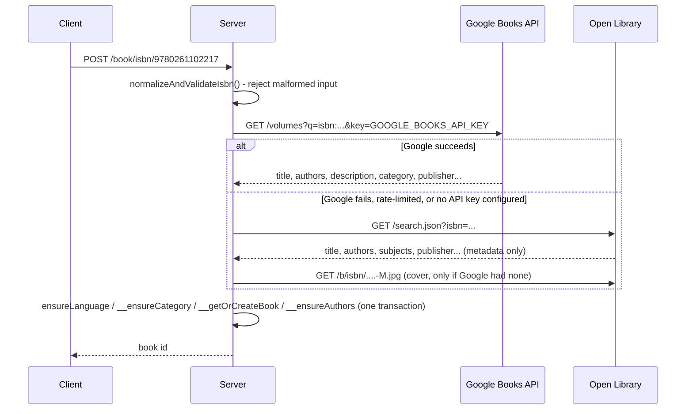

# Books: catalog & stock

The catalog module - how a book's metadata is different from a physical copy
of it, how a copy moves through its lifecycle, and how ISBN lookup fills in
metadata automatically. If you're touching anything under "Library" in the
UI, or `BooksRoute.ts` on the server, start here.

## Contents

- [Mental model: a book vs. a stock](#mental-model-a-book-vs-a-stock)
- [Creating a book](#creating-a-book)
- [ISBN auto-lookup](#isbn-auto-lookup)
- [The stock lifecycle](#the-stock-lifecycle)
- [Cover images](#cover-images)
- [Ebook file backups](#ebook-file-backups)
- [Search, counters, and filters](#search-counters-and-filters)
- [Barcode/stock-code scanning](#barcodestock-code-scanning)
- [Printing labels](#printing-labels)
- [Where this lives in code](#where-this-lives-in-code)

## Mental model: a book vs. a stock

There is exactly one library and it is the instance: every account sees the
same catalog and can add, edit, lend and delete anything in it. No request in
this module filters by the caller. `books.created_by` records who added a
title ("added by Camille") and is nullable - deleting an account leaves its
contributions in place rather than taking the household's books with it. See
[the shared-library design](superpowers/specs/2026-09-11-shared-library-admin-mobile-design.md)
for why, including the `ON DELETE SET NULL` reasoning.

`books_isbn_unique` is instance-wide, so a title is entered once: a second
member scanning the same barcode is told it's already on the shelf (manual
`POST /book`) or handed the existing book (`POST /book/isbn/:isbn`
find-or-create).

Two distinct concepts, both under "Library" in the UI:

- **A `books` row** is catalog metadata: title, description, cover, ISBN,
  category, author(s), language, publisher, page count, format. It's
  singular - "The Hobbit" is one `books` row no matter how many copies you own.
- **A `book_stocks` row** is one physical copy of that book: it has its own
  scannable `code`, a `status` (available / not available / booked / damaged),
  a `location_id` (which shelf it's on), and, when loaned out, a `customer_id`.

A book can have zero, one, or many stocks. A brand-new school library might
own five copies of the same title - one `books` row, five `book_stocks` rows,
each independently trackable and independently loanable.

## Creating a book

Two ways in, both in [`BooksRoute.ts`](../server/src/routes/BooksRoute.ts):

- **`POST /book`** - manual entry: name (required), description, ISBN, cover
  image upload. Duplicate ISBNs for the same user are rejected with 404.
- **`POST /book/isbn/:isbn`** - [auto-lookup](#isbn-auto-lookup) from an ISBN.

Both end with the same convenience: **`__automaticallyAddBookToLocation()`**
checks whether the user has *exactly one* location and, if so, silently
creates one "available" stock there. With only one shelf in the whole
library there's nothing to choose, so the app skips asking. Once a second
location exists, this stops firing and stock placement becomes explicit
(passed as `location` in the ISBN-lookup body, or added by hand afterward).

## ISBN auto-lookup

`POST /book/isbn/:isbn` turns a barcode scan into a fully-populated book
without any typing:

Details worth knowing:

- **Google Books needs `GOOGLE_BOOKS_API_KEY`** (see the root README's
  Prerequisites). Without it, or on any Google failure, the server falls
  back to Open Library's free search API automatically - no client-visible
  difference except which fields make it through (Open Library's `search.json`
  doesn't return a description, for instance).
- **429 from Google is retried** up to 3 times with linear backoff
  (`fetchBookData`'s `retries` param) before falling back.
- **Find-or-create everywhere**: category (`__ensureCategory`), author(s)
  (`__ensureAuthors`), and the book itself (`__getOrCreateBook`, matched by
  ISBN) are all find-or-create rather than blind inserts - re-scanning the
  same ISBN twice reuses the existing rows instead of creating duplicates.
- **Field truncation** (`truncate()`) protects against `VARCHAR` overflow -
  external metadata is free text with no length guarantee, so title/publisher/
  category/author names are all silently clipped to fit their columns rather
  than failing the whole insert.
- **`language_code` is normalized** to a bare 2-letter code
  (`normalizeLanguageCode`) - anything else (missing, "unknown", a 3-letter
  ISO 639-2 code) is dropped rather than stored, since `languages.code` is
  `CHAR(2)`.
- The whole DB side (language/category/book/authors/location) runs in **one
  transaction** - a partial book (e.g. authors linked but the book row
  missing) can't happen.

## The stock lifecycle

`book_stocks.status` (`BookStockStatusEnum`, mirrored identically on client
and server):

| Value | Name | Meaning |
|---|---|---|
| `0` | `AVAILABLE` | On a shelf, not lent out or damaged. |
| `1` | `NOT_AVAILABLE` | Withdrawn from circulation. |
| `2` | `BOOKED` | Currently lent/checked out to a customer. |
| `3` | `DAMAGE` | Marked as damaged. |

A stock is created with **`POST /book/:id/stock`** - one required
`location_id`, an optional `customer_id`, and a status that may *not* be `2`
(`BOOKED`) at creation time (406 if you try) - lending happens through the
loan flow below, not by hand-crafting an already-loaned stock.

**`PUT /book/:id/stock/:stock_id`** is how status/location/customer actually
change, and it's the one place that has to reconcile three related concerns
in a single statement:

- **`loaned_at`** is set only on the transition *into* `BOOKED` (not already
  `2`) and cleared on any transition *out* of it - a `CASE` expression keyed
  off both the new and previous status, so re-saving an already-booked stock
  (e.g. just moving its shelf) doesn't reset its loan date.
- **`loan_history`** gets a matching row via `recordLoan`/`recordReturn` (see
  [`LoanHistory.ts`](../server/src/utils/LoanHistory.ts)) whenever the
  transition crosses in or out of `BOOKED` - this is what the [Loans
  report](LOANS.md) reads from, since `book_stocks` itself only remembers
  the *current* loan.

The **customer- and location-facing "add books" flows**
(`POST /customer/:id/add/books`, `POST /location/:id/add/books`, and the bulk
`POST /book/return`) are thin wrappers around the same `book_stocks` update -
see [CUSTOMERS.md](CUSTOMERS.md) and [LOCATIONS.md](LOCATIONS.md) for those.

Deleting a stock (`DELETE /book/:id/stock/:stock_id`) just removes the row -
there's no soft-delete or history entry for a stock that's discarded outright
(as opposed to returned).

## Cover images

`books.image_url` holds either:

- a **`data:image/png;base64,...` / `data:image/jpeg;base64,...` URI** - our
  own uploads, via `POST /book/:id/image` (multer, 4MB cap, PNG/JPEG only) or
  the manual-create form; stored inline, no external file storage/CDN, or
- an **external URL** from the ISBN lookup (`books.google.com` or
  `covers.openlibrary.org`).

`isAllowedImageUrl()` enforces that allowlist on every write to
`image_url` - accepting an arbitrary URL here would turn the book cover
`` into a tracking-pixel/IP-disclosure vector and make the CSP `imgSrc`
allowlist in [`AppService.ts`](../server/src/AppService.ts) pointless. The
two are kept in sync deliberately; changing one without the other reopens
the gap.

## Ebook file backups

Independent of the cover image: a book can optionally have **one backed-up
file per type** - epub, pdf, and mobi (also used for `.azw3` Kindle files,
which share the same MOBI/KF8 container) - in `book_files`, which has a
`UNIQUE (book_id, file_type)` constraint. Uploading a file replaces any
existing file of that *same* type (`ON CONFLICT (book_id, file_type) DO
UPDATE`) but leaves the other types alone, so a book can carry an epub, a
pdf and a mobi backup at once.

- **`POST /book/:id/file`** - a single upload endpoint for all three types;
  the type is inferred from the file name's extension
  (`fileTypeFromName()`). Multer accepts files by extension
  (`.epub`/`.pdf`/`.mobi`/`.azw3`) up to `MAX_EBOOK_FILE_SIZE_MB` (default
  10MB, see `.env.example`), but the *bytes* are then checked against the
  real file signature (`isValidEpub`/`isValidPdf`/`isValidMobi` in
  [`FileSignature.ts`](../server/src/utils/FileSignature.ts)) before
  anything is persisted - extension-only checks are trivially spoofed by
  renaming any file.
  - A file over `MAX_EBOOK_FILE_SIZE_MB`, or a rejected `fileFilter` case,
    is turned into a clean `413`/`400` response by `handleUploadError()`
    (see [`UploadErrorMiddleware.ts`](../server/src/middlewares/UploadErrorMiddleware.ts))
    placed right after `fileUpload.single("file")` - without it, multer's
    error would fall through to Express's default handler as a bare 500,
    since this app registers no app-wide error middleware. The same helper
    also covers the cover-image and profile-picture uploads.
  - PDF: does the buffer contain the `%PDF-` header within the first 1KB.
  - EPUB: is it a zip whose *first* entry is an uncompressed file literally
    named `mimetype` containing `application/epub+zip` (the EPUB OCF spec) -
    stronger than just checking the zip signature, since that alone would
    accept a `.docx`/`.jar`/plain zip renamed to `.epub`.
  - MOBI/AZW3: does the buffer carry the `BOOKMOBI` identifier at byte
    offset 60 - the PalmDOC/MOBI header both formats share (AZW3 still
    wraps a MOBI6 header for backward compatibility).
- **`GET /book/:id/file/:fileId/download`** streams one file's raw bytes
  back with `Content-Disposition: attachment`.
- **`DELETE /book/:id/file/:fileId`** removes one file.

On the client, `BookFile.vue` renders every uploaded file as a list row
(icon, name, size/date) with download/delete actions and an "add file"
action; a preview (eye) button opens `BookFilePreviewDialog.vue`, a modal
wrapping `BookFilePreview.vue` with a fullscreen toggle. Kindle (`mobi`)
files have no in-browser renderer, so their preview shows "preview
unavailable" without fetching the file.

## Search, counters, and filters

- **`GET /book/search`** - paginated (50/page), filterable by free-text
  `query` (matches name or ISBN), `category_id` (one or more), a date range,
  and `sort` (`SortType`: `NAME_ASC` default, `NAME_DESC`, `DATE_NEWEST`,
  `DATE_OLDEST`).
- **`filters`** (comma-separated `SearchFilter` values) layer on top:

  | Filter | Meaning |
  |---|---|
  | `NO_STOCK` | Books with zero stock entries. |
  | `HAS_STOCK` | Books with at least one stock entry. |
  | `ON_LOAN` | Books with at least one stock currently `BOOKED`. |
  | `RECENT` | Added in the last 30 days. |

- **`GET /book/counters`** - four cheap counts (`total`, `recent`, `onLoan`,
  `noStock`) powering the left nav's Library quick filters
  (`AppMenu.vue`) - deliberately separate from `/search` so the nav doesn't
  need a full paginated query on every page load.

## Barcode/stock-code scanning

Anywhere a stock code or ISBN can be typed, `BarcodeScanner.vue` offers a
camera-based alternative (via `html5-qrcode`): it opens a dialog, decodes the
first barcode/QR code the device camera sees, emits the decoded text, and
closes itself. It has no opinion on what the text means - the caller (create
book by ISBN, add-to-customer, add-to-location, return-books) treats it as
plain typed input either way.

`GET /book/:bookCode/add/md` is the lookup that turns a *scanned stock code*
(not an ISBN) into a book + single stock, used by the "add to customer/
location" flows so the UI can show what was just scanned before committing
the add.

## Printing labels

Each stock's `code` can be rendered as a barcode (`BookStock.generateBarcodeImage()`
on the client) and queued in `PrintDialogController`
([`components/printDialog/`](../client/src/components/printDialog)) for a
batch print - one `<canvas>` per label, cover image alongside, laid out into
a PDF via `jsPDF`. Nothing server-side is involved in printing; the whole
label sheet is generated client-side from data already on the page.

## Where this lives in code

| Concern | File |
|---|---|
| All book/stock endpoints, ISBN lookup, image/file upload | `server/src/routes/BooksRoute.ts` |
| ISBN checksum validation | `server/src/utils/IsbnVerification.ts` |
| Epub/PDF content sniffing | `server/src/utils/FileSignature.ts` |
| `loan_history` bookkeeping | `server/src/utils/LoanHistory.ts` |
| `books`/`book_stocks`/`book_authors`/`book_files` schema | `assets/db/databaseSchema.sql` |
| Client: book detail page state | `client/src/controller/book/BookController.ts` |
| Client: `/book` HTTP client | `client/src/service/book/BookService.ts` |
| Client: book/stock model classes | `client/src/model/book/Book.ts`, `BookItem.ts`, `BookStock.ts` |
| Client: catalog search page | `client/src/views/search/BooksSearchView.vue`, `client/src/controller/search/SearchController.ts` |
| Client: book detail + stock UI | `client/src/views/book/BookView.vue`, `client/src/views/book/compoents/` |
| Client: camera barcode scanner | `client/src/components/barcodeScanner/BarcodeScanner.vue` |
| Client: label printing | `client/src/components/printDialog/` |
