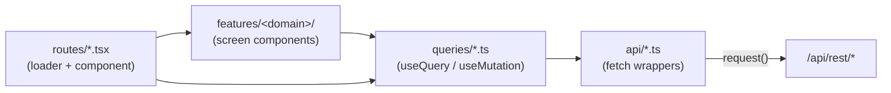

# Client architecture: api / queries / routes / features

Every screen in `client-react/` follows the same four-part shape. Once you've
seen it in one module (Categories, say) the rest read the same way - this
document is that shape in the abstract, plus the pieces of shared plumbing every
screen depends on: the fetch wrapper, the query client, and the app-policy
bootstrap.

[`client-react/README.md`](../client-react/README.md) states the same
conventions as nine short rules to follow while writing a screen. This document
is the *why* behind them, and the place to read first if you're new to the
codebase. Where the two overlap, the README is the one kept next to the code.

> This replaced a Vue 3 + Vuetify client with a `view / controller / service /
> model` split. That client is deleted; the rewrite's reasoning is recorded in
> [the React client rewrite design](superpowers/specs/2026-09-11-react-client-rewrite-design.md).

## Contents

- [The four parts](#the-four-parts)
- [`http.ts`: the shared fetch wrapper](#httpts-the-shared-fetch-wrapper)
- [Cache keys, and why they live in one file](#cache-keys-and-why-they-live-in-one-file)
- [The policy bootstrap](#the-policy-bootstrap)
- [Routing](#routing)
- [Theme](#theme)
- [Internationalization](#internationalization)
- [Where this lives in code](#where-this-lives-in-code)

## The four parts



- **`api/`** - one module per backend *resource* (`book.ts`, `customer.ts`,
  `loans.ts`, ...), each a thin wrapper translating a function call into a
  `request()` against `/api/rest/<resource>`. A module here returns parsed data
  or throws `ApiError`. It holds no state, no cache, and **no React** - which is
  also what makes it the right thing for a test to mock.
- **`queries/`** - one module per resource, exporting the `useQuery`/
  `useMutation` hooks built on `api/`. This is where "when do we fetch", "how
  long is it fresh", and "what does this mutation invalidate" live, and nowhere
  else.
- **`routes/`** - TanStack Router file-based route modules, one per screen,
  under the pathless `_app` layout. A route module is small on purpose: a
  loader that primes the cache, and the component to render.
- **`features/<domain>/`** - the screen's own components, sitting beside its
  route rather than in a global bucket. Files that change together live
  together.

Two rules hold the shape up, and breaking either is a review comment rather
than a style preference:

1. **`api/` never imports from `queries/`.** The dependency runs one way.
2. **A component never calls `api/` directly.** Always through a query hook -
   otherwise that call has no cache key, and nothing can invalidate it.

Genuinely shared UI lives in `components/` (the app shell, `ResponsiveDialog`,
`Field`, the screen loading/error/empty states, the icon barrel), and
`features/entityList/` is a shared *screen*: Locations, Categories and Authors
are all list-create-rename-delete over one name field, so they pass a small
config to `EntityListScreen` instead of each growing their own table.

## `http.ts`: the shared fetch wrapper

Every `api/` module goes through the same
[`request()`](../client-react/src/api/http.ts) rather than calling `fetch`
directly. It centralizes two things every request needs:

- **`credentials: 'include'`** - always sends the httpOnly session cookie (see
  [AUTHENTICATION.md](AUTHENTICATION.md)); no module has to remember it
  per-call.
- **Session-death detection.** A `401` carrying `sessionExpired: true` - the
  flag `requireAuth`/`requireAdmin` set, and nothing else in the API does -
  triggers a full `window.location.href = "/login"`. A real navigation, not a
  router push: there's no SPA state worth preserving once the session is gone,
  and `/login` isn't a route this app owns. Any *other* 401 (a wrong current
  password on the change-password form) and any 403 are left alone for the
  screen to render. See [what the client does when a session
  dies](AUTHENTICATION.md#what-the-client-does-when-a-session-dies), and
  [`http.test.ts`](../client-react/src/api/http.test.ts), which pins all three.

There is one wrinkle the old axios interceptor didn't have. `requireAuth` has
two failure modes: an *invalid* cookie gets the JSON above, but **no cookie at
all** gets a plain `302` to `/login`, which `fetch`'s default
`redirect: 'follow'` would swallow into an opaque success. `request()` handles
the redirect itself so both land on the same path.

What the wrapper deliberately **does not** do is the old interceptor's third
job: rendering every failure in a global error dialog. Under TanStack Query a
failed request is just `query.error` / `mutation.error`, owned by the screen
that asked for it - so the non-standard `suppressErrorDialog` opt-out the old
client needed has nothing left to opt out of. Screens render errors through the
shared [`ScreenError`/`ScreenState`](../client-react/src/components/ScreenState.tsx)
components so every screen's three non-data states look and test the same.

Retry policy lives on the [query client](../client-react/src/lib/queryClient.ts):
a 4xx is an answer rather than a hiccup, so it is never retried (retrying a dead
session would just race the `/login` navigation); other failures get two
attempts; mutations are never retried by default, because `POST /book/return`
is not idempotent in its side effects. `staleTime` is deliberately *not* set
globally - how long a resource stays fresh is a fact about that resource, and
belongs in its `queries/` module.

## Cache keys, and why they live in one file

Every key in the client is declared in
[`queries/keys.ts`](../client-react/src/queries/keys.ts), one factory per
resource. **Never inline a key array at a call site.**

The reason is the shared library. Cross-resource invalidation is routine here:
adding a book moves the dashboard's counts, the book counters, *and* the author
and category lists; returning a copy moves the loans list and the borrower's
book list. A mutation can only invalidate what it can name, and a key nobody
can name is a key nobody can invalidate - inline `['dashboard']` at one call
site and the next person writes `['dashboards']`, with no error and no effect.

Each factory follows the same hierarchy, so invalidating a parent invalidates
its children (TanStack Query matches by prefix):

```ts
bookKeys.all          // ['book']              → everything book-ish
bookKeys.counters()   // ['book', 'counters']
bookKeys.detail(12)   // ['book', 'detail', 12]
```

A mutation that touches books invalidates `bookKeys.all` and gets every book
query, present and future, without listing them.

## The policy bootstrap

`GET /app/policy` returns the current user plus every reference list -
categories, languages, formats, locations, customers - in one payload (see
[CATALOG.md](CATALOG.md#the-policy-bootstrap)). It is
[a query](../client-react/src/queries/app.ts), not a singleton service, and
that distinction is one of the points of the rewrite.

The old client fetched it once into `ApplicationService`'s reactive fields from
`App.vue`'s `onMounted`, never refetched, and let views mutate those fields
locally - `setCategories(...)` from a local array, an optimistic `splice()` on
delete. Under one library per account that was merely fragile. Since the library
became shared it is wrong: a category another member adds is invisible until a
full page reload, and two members editing concurrently silently clobber.

What replaces it:

- `staleTime` is 5 minutes - the reference lists change rarely but are read on
  nearly every screen, so refetching per navigation would be pure waste.
- `refetchOnWindowFocus` is left **on**, and is the part that actually fixes the
  bug. Returning to a tab that's been open all day is exactly when another
  member's changes are most likely to be waiting, and it costs nothing when
  nothing has changed.
- Any mutation that changes a reference list invalidates `policyKeys.all`
  rather than editing a local copy.

**There is no singleton, and there must not be one.** Anything that wants the
policy asks the cache for it, with `usePolicy()`.

## Routing

Routes are file-based: a file under
[`routes/`](../client-react/src/routes) *is* a route, and
`routeTree.gen.ts` is generated from them by `@tanstack/router-plugin` - don't
edit it by hand. `routes/_app.tsx` is the pathless authenticated layout, so
`_app/index.tsx` is `/app/` rather than `/app/_app/`.

The whole SPA is mounted under the `/app` base path (`basepath: '/app'` in
[`router.tsx`](../client-react/src/router.tsx), matching Vite's `base: '/app/'`
and the server's catch-all for `/app` and `/app/*` in `AuthRoute.ts`) - this is
what makes a hard refresh on, say, `/app/book/12` boot the app instead of
404ing.

**Loaders are where the old blank-page bug became unrepresentable.** The rule:

> `ensureQueryData` what the screen cannot render without; `prefetchQuery` what
> it can show a loading state for.

`_app.tsx` *awaits* the policy, because the shell can't draw its nav without
knowing who you are. The old client instead raced two independent lifecycles -
`App.vue`'s `onMounted` fetch against the router's global `beforeEach` guard
reading the same singleton - and when the guard won it read a `null` user and
rendered nothing. TanStack Router doesn't render a route until its loader
settles, so by the time anything below `_app` mounts the policy is *in the
cache*: `usePolicy()` returns synchronously, and there is no moment at which a
component can observe a half-loaded policy.

Screen loaders mostly `prefetchQuery` instead, so their requests start before
the component mounts without holding the navigation on a blank frame - see the
note at the top of
[`routes/_app/customers.tsx`](../client-react/src/routes/_app/customers.tsx)
for a worked example, including why some sibling lists are prefetched and
per-row lists are not.

The nav itself lives in
[`AppShell.tsx`](../client-react/src/components/AppShell.tsx): a Tamagui `Sheet`
on phones, a persistent sidebar from `sm`, with no third state. The Admin entry
is hidden for non-admins - a UI hint only, since `requireAdmin` re-checks the
role live on every request (see
[AUTHENTICATION.md](AUTHENTICATION.md#roles-and-the-admin-panel)).

## Theme

[`theme/palette.ts`](../client-react/src/theme/palette.ts) is the only file in
the client with hex values in it; everything else takes colours, radii and fonts
from the Tamagui theme. The two named themes carried over from the old client
exactly: `beige` is the light theme and `library` is the dark one, which are the
same two values `users.theme` has always held (see
[SETTINGS.md](SETTINGS.md#ui-preferences)).
[`ThemeProvider.tsx`](../client-react/src/theme/ThemeProvider.tsx) adds a third
*local* preference, "System", which has no server-side equivalent and doesn't
invent one.

Mobile floors - a 16px minimum input font-size, a 44px minimum touch target,
`100dvh` rather than `100vh`, sheets instead of oversized dialogs on phones -
are enforced structurally rather than by review, which is why every modal goes
through `components/ResponsiveDialog` and every text input through
`components/Field`. The table in
[`client-react/README.md`](../client-react/README.md#mobile-floors) says which
file owns each one.

## Internationalization

UI labels live in the database (`app_labels`, one row per `{language, code}`)
and arrive in `GET /app/policy`'s `labels` map, so editing a label or adding a
language doesn't require a frontend redeploy. The account's chosen language is
`users.language`, set from the Settings profile card.

**Nothing renders from `labels` yet.** The rewrite replaced `vue-i18n` with a
lightweight context hook, and that hook has not landed - the React client's
strings are currently hardcoded English. The payload, the column, the language
picker and the four translated label sets are all intact and waiting for it.
See the root README's
[Internationalization](../README.md#internationalization) section.

## Where this lives in code

| Concern | File |
|---|---|
| Entry point, provider order | `client-react/src/main.tsx` |
| Router construction, `/app` basepath | `client-react/src/router.tsx` |
| Generated route tree (do not edit) | `client-react/src/routeTree.gen.ts` |
| Authenticated layout + the awaited policy loader | `client-react/src/routes/_app.tsx` |
| Shared fetch wrapper, `ApiError`, session-death redirect | `client-react/src/api/http.ts` |
| Query client defaults (retry, focus refetch) | `client-react/src/lib/queryClient.ts` |
| Every cache key, declared once | `client-react/src/queries/keys.ts` |
| Policy as a query (replaces `ApplicationService`) | `client-react/src/queries/app.ts` |
| App shell, nav, admin gating | `client-react/src/components/AppShell.tsx` |
| Responsive modal (Sheet on phones, Dialog from `sm`) | `client-react/src/components/ResponsiveDialog.tsx` |
| Text input with the 16px/44px floors | `client-react/src/components/Field.tsx` |
| Screen loading / error / empty states | `client-react/src/components/ScreenState.tsx` |
| Icon barrel (never import from the lucide root) | `client-react/src/components/icons.ts` |
| Shared list-CRUD screen behind Locations/Categories/Authors | `client-react/src/features/entityList/` |
| Palette, Tamagui config, global CSS, theme provider | `client-react/src/theme/` |
| Test render helper, fixtures, Vitest setup | `client-react/src/test/` |
