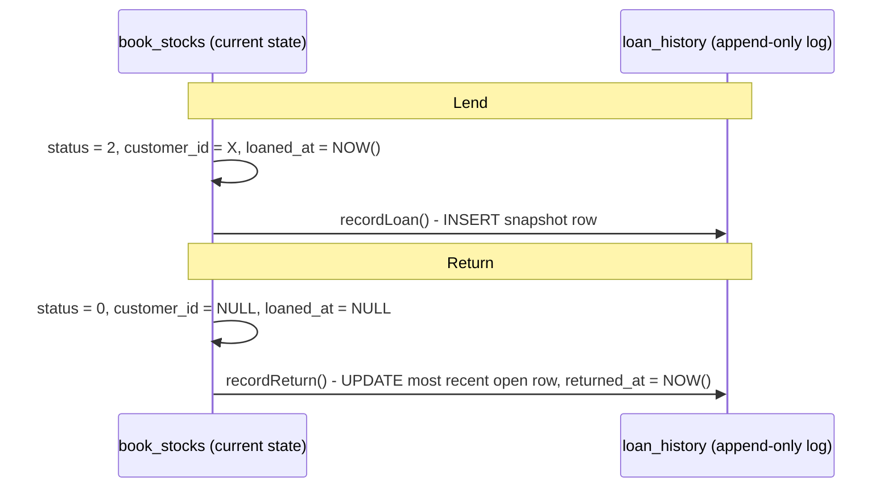

# Loans

A read-only view over lending activity: what's currently out, and a full
historical report of every loan ever made. If [CUSTOMERS.md](CUSTOMERS.md)
is about *doing* a lend/return, this is about *listing and reporting on*
them afterward.

## Contents

- [`book_stocks` vs. `loan_history`](#book_stocks-vs-loan_history)
- [Currently on loan](#currently-on-loan)
- [The loan history report](#the-loan-history-report)
- [Where this lives in code](#where-this-lives-in-code)

## `book_stocks` vs. `loan_history`

Two tables, two different jobs:

- **`book_stocks`** knows the *current* state only. `status = 2` +
  `customer_id` = "on loan to this borrower right now." Once returned,
  `customer_id`/`loaned_at` are wiped - there's no way to ask `book_stocks`
  "who had this book last March."
- **`loan_history`** is an append-only log, one row per loan, written
  alongside every `book_stocks` transition into/out of `BOOKED` (see
  [`LoanHistory.ts`](../server/src/utils/LoanHistory.ts), called from both
  `BooksRoute.ts` and `CustomerRoute.ts`). Each row snapshots the book name,
  borrower name, and group name *as they were at loan time* - so renaming or
  deleting a borrower/group/book later doesn't corrupt historical reports,
  it just stops being reflected in future rows.

`recordLoan`/`recordReturn` must be called by every code path that changes
`book_stocks.status` into or out of `2` - forgetting one leaves the current
state correct but the history silently incomplete, so if you add a new way
to lend/return a book, wire this in too.

## Currently on loan

`GET /loans` ([`LoansRoute.ts`](../server/src/routes/LoansRoute.ts)) lists
every `book_stocks` row with `status = 2`, paginated (50/page), filterable
by borrower group and a loan-date range, newest first. This reads
`book_stocks` directly (not `loan_history`) since it only cares about *now*.

Returning a book from this list reuses the existing
`POST /book/return` endpoint (see [BOOKS.md](BOOKS.md)) - `LoansRoute.ts` is
deliberately listing-only, no mutation endpoints of its own.

## The loan history report

`GET /loans/report` is what the Loans screen's report dialog reads:
every loan (returned or still open) in a **required** date range, optionally
narrowed by borrower group and/or a single borrower. Backed by
`loan_history`, so returned loans show up too - unlike `GET /loans`, this is
how you'd answer "how many books did Class 4B borrow last semester."

`date_from`/`date_to` are required (400 if either is missing) - this
endpoint is meant for a bounded report, not a full-table dump.

The old client's only output for this was an `.xlsx` pushed at the browser via
`exceljs`. The React client renders the rows on screen instead, with a CSV
download beside them - see the note at the top of `LoanReportDialog.tsx`.

## Where this lives in code

| Concern | File |
|---|---|
| Currently-on-loan listing, history report | `server/src/routes/LoansRoute.ts` |
| `loan_history` read/write helpers | `server/src/utils/LoanHistory.ts` |
| Lend/return actions (mutate `book_stocks` + call the helpers above) | `server/src/routes/CustomerRoute.ts`, `server/src/routes/BooksRoute.ts` |
| `loan_history`/`book_stocks` schema | `assets/db/databaseSchema.sql` |
| Client: `/loans` HTTP client | `client-react/src/api/loans.ts` |
| Client: query hooks + cache keys | `client-react/src/queries/loans.ts` |
| Client: loans route | `client-react/src/routes/_app/loans.tsx` |
| Client: loans page UI + report dialog | `client-react/src/features/loans/LoansScreen.tsx`, `LoanFilters.tsx`, `LoanReportDialog.tsx` |
| Client: bulk-return dialog | `client-react/src/features/dashboard/ReturnBooksDialog.tsx` |
